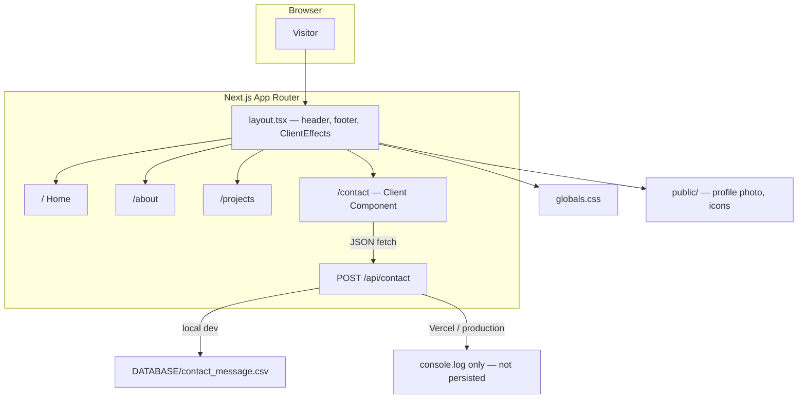

# Abdulrhman Mohammed Badr — Portfolio

Personal website for an **AI & Data Science** specialist. It is a small Next.js app: public pages for profile and work, plus a contact form with an API route.

The site was built with **vibe coding** (AI-assisted development) while learning Next.js by shipping, not from a formal Next.js course.

**Live:** check the Vercel production deployment on this repo  
**GitHub:** [zbady991](https://github.com/zbady991)  
**LinkedIn:** [abdulrahman-mohammed](https://www.linkedin.com/in/abdulrahman-mohammed-458991302/)  
**Kaggle:** [abdelrahmanmo911](https://www.kaggle.com/abdelrahmanmo911)

---

## Idea

The goal is a fast, readable portfolio that answers three questions:

1. Who I am (AI / data science, Egypt, open to freelance and full-time)
2. What I do (ML, data engineering, analytics)
3. How to reach me (email, LinkedIn, contact form)

It is **not** a large product: no auth, no CMS, no real database. Pages are mostly static content. The only backend piece is `POST /api/contact`.

---

## Features

- Home: intro, photo, skills, impact metrics, services, social links
- About: short experience / stack / approach
- Projects: selected work (churn prediction, recommendation system, analytics dashboard)
- Contact form with client-side submit and success/error messages
- Shared layout: sticky nav, footer, back-to-top, scroll reveal
- Local contact log: messages appended to `DATABASE/contact_message.csv` in development

---

## Tech stack

| Layer | Choice |
|---|---|
| Framework | Next.js 15 (App Router, Turbopack) |
| UI | React 19 |
| Language | TypeScript |
| Styling | Global CSS (`app/globals.css`) |
| Fonts | Inter via `next/font` |
| Images | `next/image` + files in `public/` |
| Contact API | Next.js Route Handler |
| Local storage | JSON lines in a CSV file |
| Hosting | Vercel |

---

## Architecture

Default pages are **Server Components**. Interactivity uses `"use client"` only where needed (form + scroll effects).



### How a request works

1. Next.js matches the URL to a file under `app/`.
2. `layout.tsx` wraps every page (nav + footer).
3. Home / About / Projects render on the server as HTML.
4. Contact is a client form. Submit sends JSON to `/api/contact`.
5. The API checks `name`, `email`, `message`.
   - **Local:** append one JSON line to `DATABASE/contact_message.csv`.
   - **Production (Vercel):** filesystem is not persistent, so the handler logs the message and returns success without saving.

### Project structure

```text
app/
  layout.tsx              # Shared chrome + metadata
  page.tsx                # Home
  globals.css             # Theme and layout styles
  about/page.tsx
  projects/page.tsx
  contact/page.tsx        # Client form
  api/contact/route.ts    # POST handler
  components/ClientEffects.tsx
public/                   # Static files (profile.jpeg, svgs)
DATABASE/                 # Local contact log (do not commit real messages)
```

---

## Run locally

**Need:** Node.js (LTS) and npm.

```bash
npm install
npm run dev
```

Open [http://localhost:3000](http://localhost:3000).

Other scripts:

```bash
npm run build    # production build
npm start        # serve the build
npm run lint     # ESLint
```

No `.env` file is required for the current version.

---

## Contact API

`POST /api/contact`

```json
{
  "name": "Your name",
  "email": "you@email.com",
  "message": "Hello"
}
```

| Status | Meaning |
|---|---|
| `200` `{ ok: true, persisted: true }` | Saved locally to CSV |
| `200` `{ ok: true, persisted: false }` | Accepted on Vercel, not stored |
| `400` | Missing fields |
| `500` | Server error |

---

## Known limitations / next work

Honest list of gaps — useful as a learning roadmap:

1. **Production contact form does not persist messages.** Wire email (Resend, Formspree) or a sheet/database.
2. **Do not commit `DATABASE/`.** It can contain real visitor emails. Add it to `.gitignore` and remove it from git history if it was pushed.
3. **Mobile nav is hidden** (`display: none` on small screens) with no hamburger menu.
4. **Placeholder copy** still exists on the home page (`pick your focus`).
5. **About / Projects** are thinner than Home (no repo links, images, or case-study pages).
6. **SEO is minimal** (generic title, no Open Graph, no sitemap).
7. **Form has no spam protection** (rate limit / captcha / honeypot) and only basic validation.
8. **`page.module.css`** is leftover from the Next.js starter and unused.

---

## Author

**Abdulrhman Mohammed Badr** — AI & Data Science  
Egypt · [bedoobadr997@gmail.com](mailto:bedoobadr997@gmail.com)

---

## بالعربية — الفكرة باختصار

ده بورتفوليو شخصي لمتخصص AI و Data Science، مبني بـ **Next.js 15** و **React 19** و **TypeScript**.

الفكرة: موقع بسيط يعرّف بيّ، يعرض شغلي، ويخلّي التواصل سهل. مش منتج كبير: مفيش تسجيل دخول ولا قاعدة بيانات حقيقية. الصفحات أغلبها محتوى ثابت. الجزء الوحيد اللي شبه backend هو فورم التواصل (`POST /api/contact`).

اتبنى بـ **vibe coding**: وصف المطلوب، مراجعة الناتج، تعديل، وتعلّم Next.js أثناء التنفيذ مش من كورس رسمي.

**التشغيل:** `npm install` ثم `npm run dev` ثم افتح `http://localhost:3000`.

**مهم:** على Vercel الرسائل مش بتتحفظ في ملف (الـ filesystem مش دائم). محليًا بتتخزن في `DATABASE/contact_message.csv` — الملف ده المفروض ما يترفعش على GitHub لو فيه بيانات حقيقية.
